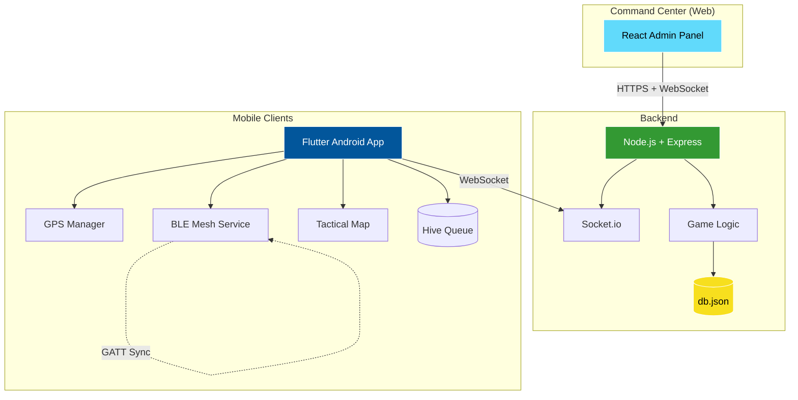
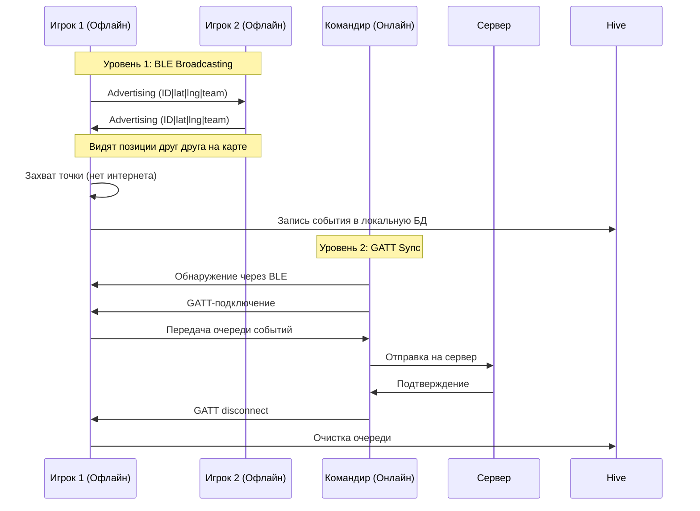

# SQUADRON: StrikeMap 🎖️

**Тактическая мобильная система для страйкбола, милсима и лазертага с полной работоспособностью в офлайн-режиме через BLE Mesh**

[](LICENSE)
[](https://flutter.dev)
[](https://nodejs.org)
[](https://developer.android.com)
[](https://github.com/LordinsX/SQUADRON-StrikeMap/issues)
[](https://github.com/LordinsX/SQUADRON-StrikeMap/stargazers)

---

## 📋 Оглавление

- [О проекте](#-о-проекте)
- [Ключевые возможности](#-ключевые-возможности)
- [Архитектура](#-архитектура)
- [Технологический стек](#-технологический-стек)
- [Быстрый старт](#-быстрый-старт)
- [Установка](#-установка)
- [Использование](#-использование)
- [Конфигурация](#-конфигурация)
- [Структура проекта](#-структура-проекта)
- [API документация](#-api-документация)
- [Roadmap](#-roadmap)
- [Contributing](#-contributing)
- [Лицензия](#-лицензия)
- [Контакты](#-контакты)

---

## 🎯 О проекте

**SQUADRON: StrikeMap** — это комплексная тактическая система для проведения военных игр, которая решает главную проблему подобных мероприятий: **отсутствие стабильного интернета на полигонах**.

### Основная идея

Система работает в **гибридном режиме**:
- **Онлайн**: полная синхронизация через WebSocket с центральным сервером
- **Офлайн**: автономная работа через **BLE Mesh** сеть между устройствами игроков

Это позволяет проводить игры в любых условиях: леса, поля, заброшенные здания, подземные сооружения.

---

## ✨ Ключевые возможности

### 🗺️ Тактическая карта
- **OpenStreetMap** тайлы с наложением векторной графики
- **Туман войны**: фильтрация видимости по ролям (Солдат / Командир / Игротех)
- **Сетка координат**: квадраты A–J, 1–8 для тактического общения
- **Типы объектов**:
  - 🏢 Здания (полигоны с заливкой по команде)
  - 🛣️ Дороги (шоссе / грунтовки)
  - 🚩 POI (флаги, медпункты, базы)
  - 💀 Kill Zones (минные поля)
  - 🎯 Вейпоинты (метки с автоудалением через 10 мин)
  - ➡️ Векторы (линии атаки / защиты / движения)

### 📡 BLE Mesh сеть (Офлайн-режим)
- **Уровень 1**: Broadcasting позиций через BLE Advertising (до 20 байт на пакет)
- **Уровень 2**: GATT-синхронизация событий (захват точек, SOS, вейпоинты)
- Автоматическая синхронизация при обнаружении устройства-командира с интернетом
- Локальная очередь событий в **Hive** базе данных

### 🎮 Боевые механики
- **Автозахват точек** (Geo-fencing, радиус 15 м по умолчанию)
- **Kill Zones**: автоматическая «смерть» при входе в минное поле
- **Респавн**: возрождение только на базах после таймера (60 сек)
- **SOS**: кнопка тревоги с мигающим маркером у союзников
- **Proximity Radar**: обнаружение врагов через BLE (< 50 м)
  - Вибрация (двойной удар)
  - Направление (СПЕРЕДИ / СПРАВА / СЛЕВА / СЗАДИ)

### 🔋 Оптимизация
- **Foreground Service**: работа GPS и BLE при выключенном экране
- **GPS-фильтрация**: отбрасывание точек с точностью > 40 м
- **Энергопотребление**: 4–6 часов на одном заряде
- **Темная тема**: адаптация для работы в перчатках

### 🖥️ Командный центр (Админ-панель)
- Управление матчем (Старт / Стоп / Пауза / Таймер)
- Мониторинг всех игроков в реальном времени
- Создание и импорт POI через JSON
- Управление взводами и распределением игроков
- Журнал событий и статистика
- Генерация токенов для игротехов
- Вещание сообщений командам

---

## 🏗️ Архитектура



### Схема работы офлайн-режима



---

## 🛠️ Технологический стек

| Слой | Технологии |
|------|-----------|
| **Клиент (Android)** | Flutter 3.16+, flutter_map, latlong2, flutter_blue_plus, geolocator, flutter_background, hive, socket_io_client, riverpod |
| **Сервер** | Node.js 18+, Express, Socket.io, uuid, winston, PM2 |
| **Админ-панель** | React 18+, TypeScript, Socket.io-client, TailwindCSS, react-map-gl |
| **DevOps** | Docker, GitHub Actions, Nginx, Let's Encrypt |

---

## 🚀 Быстрый старт

### Предварительные требования

```bash
flutter --version  # 3.16+
node --version     # 18+
npm --version      # 9+
# Android Studio с Android SDK 34
```

### 1. Клонирование репозитория

```bash
git clone https://github.com/LordinsX/SQUADRON-StrikeMap.git
cd SQUADRON-StrikeMap
```

### 2. Установка зависимостей

```bash
# Клиент
cd client
flutter pub get

# Сервер
cd ../server
npm install

# Админка
cd ../admin
npm install
```

### 3. Настройка окружения

```bash
# Сервер
cd server
cp .env.example .env

# Клиент
cd ../client
cp .env.example .env

# Админка
cd ../admin
cp .env.example .env
```

### 4. Запуск в development режиме

```bash
# Терминал 1: Сервер
cd server
npm run dev

# Терминал 2: Админка
cd admin
npm start

# Терминал 3: Клиент
cd client
flutter run
```

---

## 📦 Установка

### Клиент (Android APK)

#### Debug-версия (для тестирования)

```bash
cd client
flutter build apk --debug
adb install build/app/outputs/flutter-apk/app-debug.apk
```

#### Release-версия (для продакшена)

```bash
cd client

# Создание keystore
keytool -genkey -v -keystore android/app/upload-keystore.jks \
  -keyalg RSA -keysize 2048 -validity 10000 \
  -alias upload

# Настройка подписи
cat > android/key.properties << EOF
storePassword=your_password
keyPassword=your_password
keyAlias=upload
storeFile=app/upload-keystore.jks
EOF

# Сборка с разделением по архитектурам
flutter build apk --release --split-per-abi
```

Результат в `build/app/outputs/flutter-apk/`:
- `app-arm64-v8a-release.apk` (64-bit ARM, рекомендуется)
- `app-armeabi-v7a-release.apk` (32-bit ARM)
- `app-x86_64-release.apk` (x86_64, для эмуляторов)

### Сервер

#### Локальный запуск

```bash
cd server
npm install
npm start
```

#### Production с PM2

```bash
npm install -g pm2
cd server
pm2 start server.js --name squadron-server
pm2 save
pm2 startup
```

#### Docker

```bash
cd server
docker build -t squadron-server .
docker run -d -p 3000:3000 -v $(pwd)/data:/app/data --name squadron squadron-server
```

### Админ-панель

```bash
cd admin
npm run build
sudo cp -r build/* /var/www/squadron-admin/
```

---

## 🎮 Использование

### Для игроков

1. **Установите APK** на Android-устройство
2. **Запустите приложение** и разрешите доступ к GPS и Bluetooth
3. **Введите позывной** и выберите:
   - Команду (Красные / Синие)
   - Роль (Солдат / Командир)
   - ID взвода
4. **Дождитесь старта матча** от администратора
5. **Играйте!** Система работает автоматически

### Для командиров

- Видите всех игроков обеих команд
- Создавайте вейпоинты и векторы для координации
- Полная картина тактической обстановки

### Для игротехов

- Вход по одноразовому токену (через QR-код или ввод)
- Полный доступ ко всем данным для судейства

### Для администраторов

- Создание матча, POI и взводов
- Запуск/остановка игры через Command Center
- Мониторинг в реальном времени
- Экспорт статистики

---

## ⚙️ Конфигурация

### Сервер (`.env`)

```env
PORT=3000
NODE_ENV=production
DB_PATH=./data/db.json
BACKUP_PATH=./data/backups
JWT_SECRET=your-super-secret-key
CORS_ORIGIN=https://admin.your-domain.com
```

### Клиент (`.env`)

```env
SERVER_URL=https://your-server.com
SOCKET_URL=wss://your-server.com
DEFAULT_LAT=55.7558
DEFAULT_LNG=37.6173
```

### Админ-панель (`.env`)

```env
REACT_APP_API_URL=https://your-server.com
REACT_APP_SOCKET_URL=wss://your-server.com
REACT_APP_MAPBOX_TOKEN=your_mapbox_token
```

### GPS-настройки (`client/lib/config.dart`)

```dart
class GpsConfig {
  static const int geoMaxAccuracy = 40;        // метров (отбрасываем хуже)
  static const double geoMinMoveMeters = 4.0;  // минимальное смещение
  static const Duration updateInterval = Duration(seconds: 2);
}
```

### BLE-настройки (`client/lib/config.dart`)

```dart
class BleConfig {
  static const Duration advertisingInterval = Duration(milliseconds: 500);
  static const int maxPacketSize = 20;      // байт
  static const double radarDistance = 50.0; // метров
}
```

---

## 📁 Структура проекта

```
SQUADRON-StrikeMap/
├── client/                     # Flutter Android приложение
│   ├── lib/
│   │   ├── features/          # Feature-first модули
│   │   │   ├── auth/          # Авторизация
│   │   │   ├── map/           # Тактическая карта
│   │   │   ├── mesh/          # BLE Mesh сервис
│   │   │   ├── geo/           # GPS менеджер
│   │   │   ├── radar/         # Proximity радар
│   │   │   ├── background/    # Foreground Service
│   │   │   └── network/       # Socket.io клиент
│   │   ├── models/            # Data models
│   │   ├── providers/         # Riverpod providers
│   │   ├── services/          # Бизнес-логика
│   │   ├── utils/             # Утилиты
│   │   └── main.dart          # Entry point
│   ├── android/               # Нативный код
│   └── pubspec.yaml           # Flutter-зависимости
│
├── server/                     # Node.js backend
│   ├── src/
│   │   ├── routes/            # Express routes
│   │   ├── sockets/           # Socket.io handlers
│   │   ├── services/          # Game logic
│   │   └── server.js          # Entry point
│   ├── data/                  # db.json и backups
│   ├── Dockerfile
│   └── package.json
│
├── admin/                      # React админ-панель
│   ├── src/
│   │   ├── components/
│   │   ├── pages/
│   │   └── App.tsx
│   └── package.json
│
├── docs/                       # Документация
├── .github/workflows/          # CI/CD
├── README.md                   # Этот файл
├── LICENSE
└── CONTRIBUTING.md
```

---

## 📚 API документация

### Socket.io Events

#### Клиент → Сервер

| Event | Payload | Описание |
|-------|---------|----------|
| `player:join` | `{callsign, team, role, squadId}` | Вход в игру |
| `player:position` | `{lat, lng, accuracy, heading}` | Обновление позиции |
| `zone:capture` | `{poiId}` | Захват точки |
| `player:sos` | — | Активация SOS |
| `waypoint:create` | `{type, lat, lng, label}` | Создание вейпоинта |
| `vector:create` | `{type, from, to}` | Создание вектора |

#### Сервер → Клиент

| Event | Payload | Описание |
|-------|---------|----------|
| `game:state` | `GameState` | Полное состояние игры |
| `players:update` | `{[id]: Player}` | Обновление игроков |
| `pois:update` | `{[id]: Poi}` | Обновление POI |
| `scores:update` | `{red, blue}` | Обновление счёта |
| `match:status` | `Match` | Статус матча |
| `match:timer` | `number` | Таймер матча |

### REST API

```bash
GET  /api/state           # Состояние игры
POST /api/pois            # Создание POI
POST /api/tokens          # Генерация токена игротеха
POST /api/pois/import     # Импорт POI из JSON
```

Полная документация: [docs/API.md](docs/API.md)

---

## 🗺️ Roadmap

### v0.1 — Текущая
- ✅ Базовая тактическая карта
- ✅ BLE Mesh сеть (Advertising + GATT)
- ✅ Geo-fencing и автозахват
- ✅ Kill Zones и респавн
- ✅ Proximity-радар
- ✅ Админ-панель
- ✅ Foreground Service

### v0.5 — Планируется
- ⏳ Голосовая связь (WebRTC)
- ⏳ Запись треков игроков
- ⏳ Экспорт статистики матча
- ⏳ Push-уведомления
- ⏳ Мультиязычность (RU/EN)

### v1.0 — Будущее
- ⏳ iOS-поддержка
- ⏳ AR-режим (дополненная реальность)
- ⏳ Создание кастомного сценария
- ⏳ AI-анализ тактики
- ⏳ Replay-система

---

## 🤝 Contributing

Приветствуем любой вклад в развитие проекта!

### Как помочь

1. **Fork** репозитория
2. Создайте **feature branch**: `git checkout -b feature/AmazingFeature`
3. **Commit** изменения: `git commit -m 'Add AmazingFeature'`
4. **Push** в branch: `git push origin feature/AmazingFeature`
5. Откройте **Pull Request**

### Сообщить о баге

Откройте [Issue](https://github.com/LordinsX/SQUADRON-StrikeMap/issues/new?template=bug_report.md) с подробным описанием.

### Запросить фичу

Откройте [Issue](https://github.com/LordinsX/SQUADRON-StrikeMap/issues/new?template=feature_request.md) с описанием идеи.

---

## 📄 Лицензия

Проект распространяется под лицензией **GPL-V3.0**. См. файл [LICENSE](LICENSE) для деталей.

---

## 📞 Контакты

- **GitHub**: [@LordinsX](https://github.com/LordinsX)
- **Репозиторий**: [github.com/LordinsX/SQUADRON-StrikeMap](https://github.com/LordinsX/SQUADRON-StrikeMap)
- **Issues**: [github.com/LordinsX/SQUADRON-StrikeMap/issues](https://github.com/LordinsX/SQUADRON-StrikeMap/issues)

---

## 🙏 Благодарности

- [Flutter](https://flutter.dev) — за отличный кроссплатформенный фреймворк
- [OpenStreetMap](https://www.openstreetmap.org) — за бесплатные карты
- [Socket.io](https://socket.io) — за надёжный real-time
- Всем тестерам, контрибьюторам и тактическому сообществу!

---

<div align="center">

**Сделано с ❤️ для тактического сообщества**

[⭐ Поставить звезду](https://github.com/LordinsX/SQUADRON-StrikeMap) · [🐛 Сообщить о баге](https://github.com/LordinsX/SQUADRON-StrikeMap/issues) · [💡 Предложить идею](https://github.com/LordinsX/SQUADRON-StrikeMap/issues)

</div>
